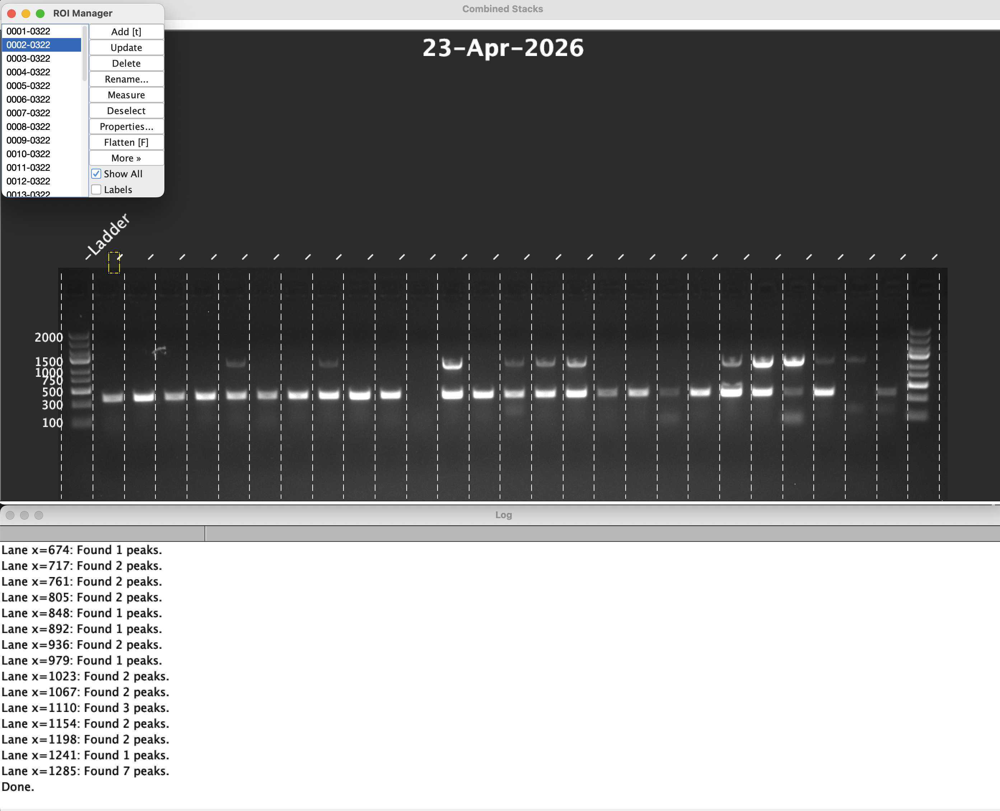
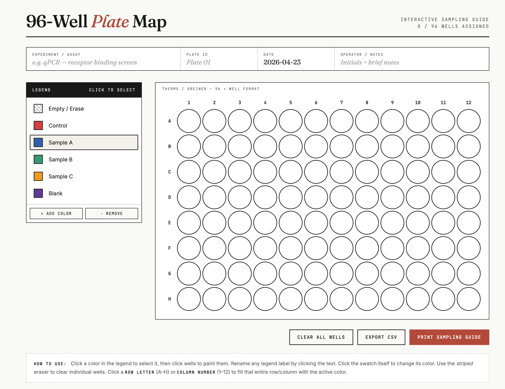

# Lab Tools

Small, practical lab utilities for day-to-day workflows.

This repository is organized by tool type so it can grow without becoming messy.

## Repository Structure

```text
lab_tools/
├── tools/
│   ├── fiji/
│   │   └── gel_label.ijm
│   └── web/
│       └── 96_well_plate_map.html
├── screenshots/
│   ├── 96-well-plate-map.png
│   └── gel-label-macro.png
└── README.md
```

## Tools

### 1) Gel Label Macro (Fiji / ImageJ)

- Path: `tools/fiji/gel_label.ijm`
- Purpose: interactively label gel lanes by selecting first and last lanes, auto-spacing ticks, and adding a title.
- Best for: quick lane annotation workflows where lane count varies per gel.



#### How to use

1. Open Fiji/ImageJ.
2. Open your gel image.
3. Load and run the macro from `tools/fiji/gel_label.ijm`.
4. Click in the title area to set a title.
5. Click the first lane and last lane.
6. Adjust lane count in the preview dialog until ticks match, then accept.

#### Notes

- If you paste the macro into startup macros, the bracketed key in the macro name can be used as a shortcut.
- Outside startup macros, that bracketed key is just part of the macro name.

### 2) 96-Well Plate Map (Web)

- Path: `tools/web/96_well_plate_map.html`
- Purpose: interactive 96-well layout planner with color legend, row/column fill, CSV import/export, and print mode.
- Best for: planning sample placement and sharing printable plate maps.



#### How to use

1. Open `tools/web/96_well_plate_map.html` in a browser.
2. Select a legend color, then click wells to assign samples.
3. Use row/column labels to fill entire rows/columns.
4. Export assignments with CSV, or print a sampling guide.

